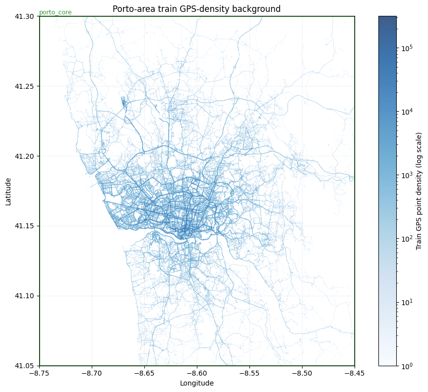
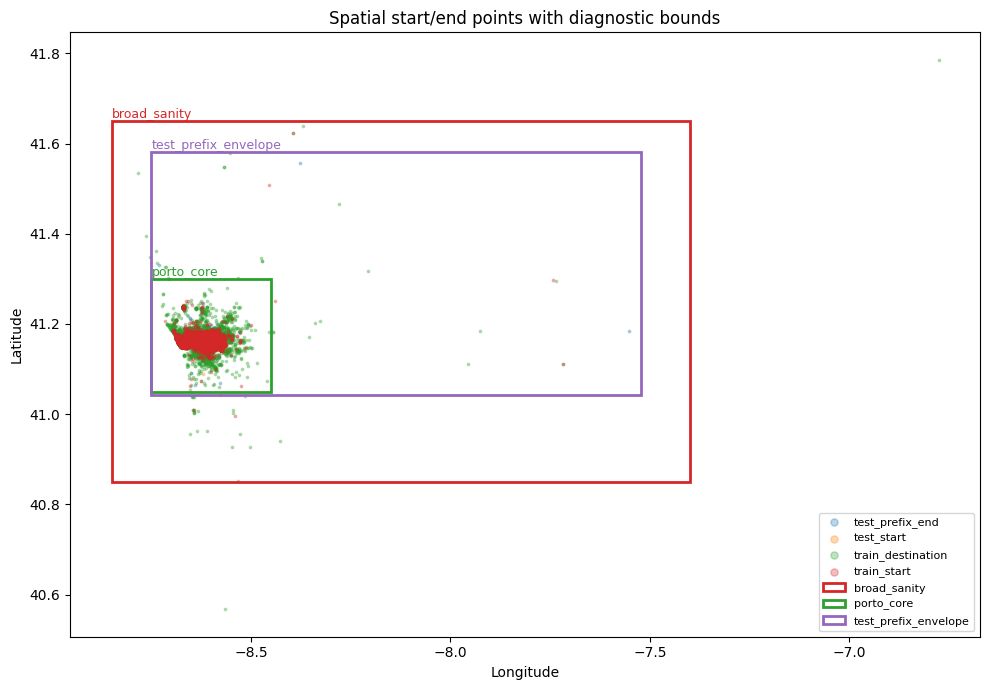
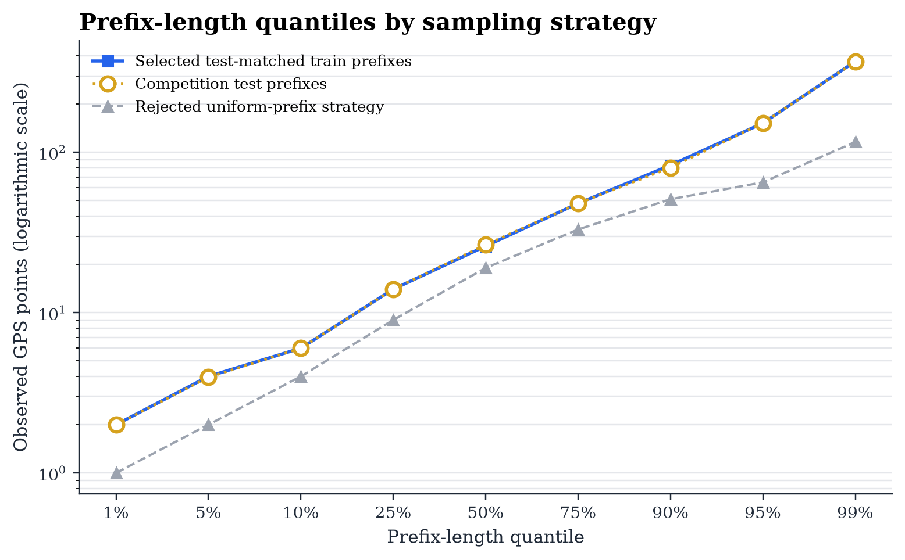
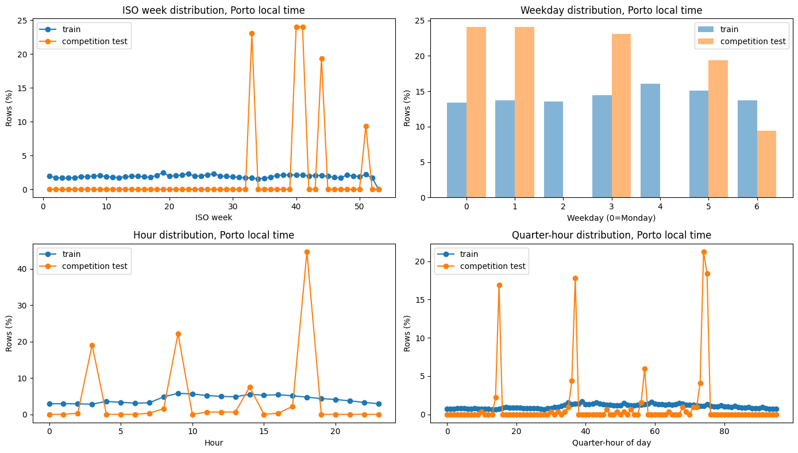
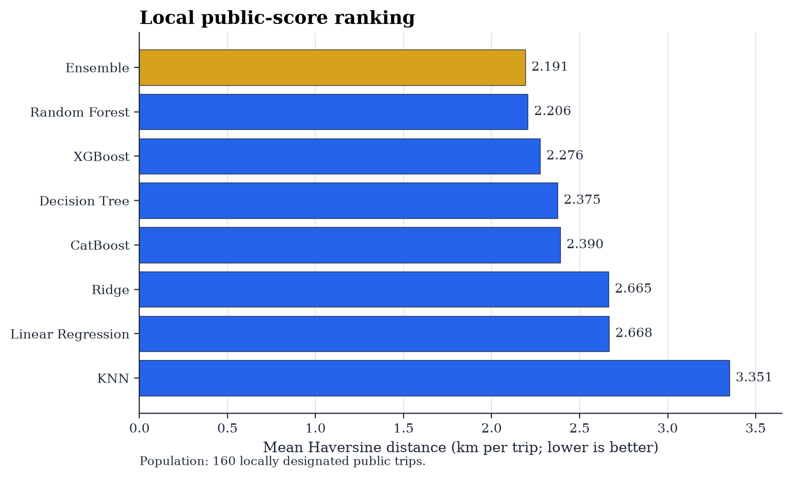
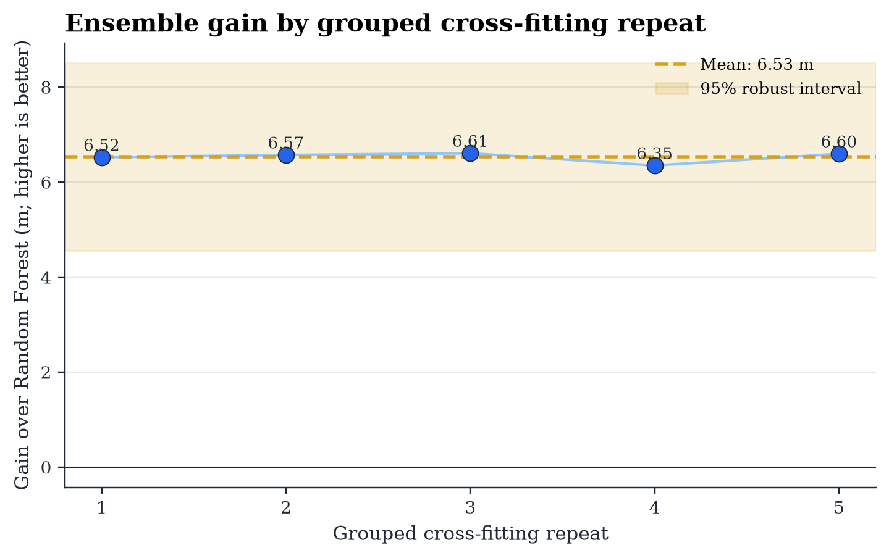

# Taxi Destination Prediction from Partial Trajectories

An end-to-end machine learning system trained on 1.67M Porto taxi trips, ranked 1st in the ELEN0062 class competition, with a best public score of 2.191 km.

  

## Project Overview

Given a variable-length initial GPS trajectory and trip metadata, this project predicts the taxi's final latitude and longitude. The dataset covers one year of operations by 442 taxis in Porto: 1,710,670 complete training trajectories and 320 partial competition trips.

After cleaning the raw data, we simulate the competition setting by truncating each retained trip to a length sampled from the unlabeled test-prefix distribution. We then combine each partial trajectory with its associated trip metadata to create a fixed-size feature vector containing GPS, temporal, and dispatch information, fitting all transformations on training data only.

Seven standalone regressors are evaluated under a shared validation design before combining the strongest complementary models, Random Forest and XGBoost. Performance is measured by mean Haversine distance in kilometres, where lower is better, and no external geographic data are used. Further methodology, experiments, and analysis are available in the [full technical report](https://github.com/louishgg/machine-learning-3/blob/main/report/report.pdf).

Together, these stages form the following end-to-end workflow:

<strong>Raw trajectories &rarr; cleaning &rarr; test-matched prefixes &rarr; feature engineering &rarr; model comparison &rarr; ensemble</strong>

## Repository Structure

<pre>
├── <a href="notebooks/">notebooks/</a>     Dataset analysis, seven standalone models, and ensemble
├── <a href="code/">code/</a>          Preprocessing builder and local submission scorer
├── <a href="data/">data/</a>          Competition data and cached preprocessing datasets
├── <a href="outputs/">outputs/</a>       Model artifacts, diagnostics, and plots
├── <a href="submission/">submission/</a>    Final predictions and scoring results
└── <a href="report/">report/</a>        LaTeX source, figures, and compiled report
</pre>

## Results Summary

### Dataset Analysis and Preprocessing

The raw dataset contains **1,710,670 complete trips from 442 Porto taxis** over one year and **320 partial competition trips** from the following year. Both CSVs share nine fields. GPS coordinates are recorded every 15 seconds as `[LONGITUDE, LATITUDE]`; a training `POLYLINE` ends at the destination, whereas a test `POLYLINE` contains only the observed prefix.

**Table 1. Raw CSV schema.**

| Field | Type | Values / scope | Meaning |
|---|---|---|---|
| `TRIP_ID` | String | May repeat | Trip identifier |
| `CALL_TYPE` | Character | A, B, or C | Central call, taxi stand, or street hail |
| `ORIGIN_CALL` | Integer | Type A; may be missing | Anonymized caller identifier |
| `ORIGIN_STAND` | Integer | Type B; otherwise missing | Taxi-stand identifier |
| `TAXI_ID` | Integer | 442 taxis | Taxi identifier |
| `TIMESTAMP` | Integer | Unix seconds | Trip start time |
| `DAY_TYPE` | Character | A, B, or C | Normal day, holiday, or pre-holiday |
| `MISSING_DATA` | Boolean | True or False | Whether the GPS stream has missing samples |
| `POLYLINE` | List as string | Coordinate pairs | GPS samples; final training point is the destination, while test rows contain a prefix |

The preprocessing pipeline then creates competition-aligned, fixed-width inputs:

- **Clean:** Remove missing, invalid, or shorter-than-two-point trajectories; filter spatial outliers; and discard trips longer than four hours only when they remain within 20 km of their start. **1,672,901 trajectories (97.8%)** remain.
- **Split and transform:** Create a shuffled 80/20 validation split, fitting encoders, frequency statistics, and coordinate scalers on the training partition only.
- **Generate prefixes:** Sample lengths from the 320 unlabeled competition prefixes and withhold each trip's destination as its target. The synthetic and test median and 95th percentile closely match: **26 versus 26.5** and **152 versus 152.15 GPS points**.
- **Engineer features:** Combine the first and last five GPS points, 12 numerical and cyclical variables, and one-hot dispatch metadata in a **541-feature** matrix. CatBoost uses 36 columns with native categorical variables.

  
  

The competition trips are concentrated in later ISO weeks and a small set of observation times compared with the training year, supporting cyclical calendar features and highlighting the temporal shift between the two datasets.

  

### Model Performance

The RF-XGBoost ensemble ranked 1st in the class competition. Random Forest was the strongest standalone model, while the fixed **81.399% Random Forest / 18.601% XGBoost** blend produced the best final result.

| Model | Validation | Local public | Local private | All trips |
|---|---:|---:|---:|---:|
| **Ensemble** | **2.113** | **2.191** | **2.500** | **2.346** |
| Random Forest | 2.119 | 2.206 | 2.514 | 2.360 |
| XGBoost | 2.215 | 2.276 | 2.527 | 2.402 |

All values are mean Haversine distance in kilometres; lower is better. The ensemble validation value is a grouped cross-fitted estimate, while the standalone values use the shared holdout.

  
  

The ensemble improves over Random Forest by **15.1 m**, or **0.684%**, on the local public split. Its grouped cross-fitted gain averages **6.53 m** and is positive across all **25 held-out folds**.
